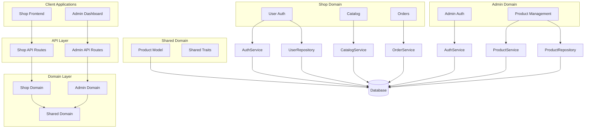
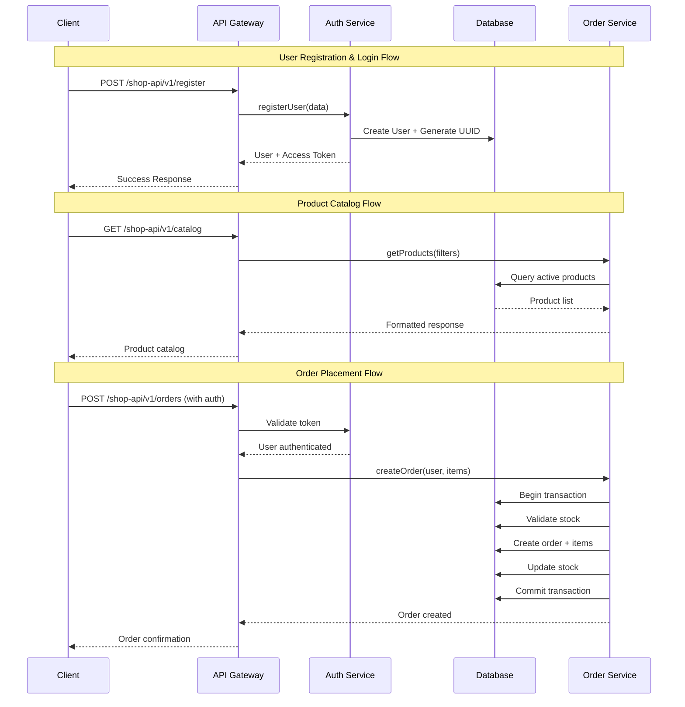

# Laravel E-commerce API

A modern, domain-driven e-commerce API built with Laravel, featuring separate authentication systems for shop users and admin users, with comprehensive product and order management capabilities.

## Architecture Overview



## Key Features

### Dual Authentication System
- **Shop Users**: Customer authentication with Laravel Passport OAuth2
- **Admin Users**: Administrative authentication with separate guard system
- **Token Management**: Automatic token revocation and refresh handling

### Domain-Driven Architecture
```
app/Domains/
├── Admin/
│   ├── Auth/           # Admin authentication
│   └── Product/        # Product management
├── Shop/
│   ├── User/          # Customer management
│   ├── Catalog/       # Product catalog
│   └── Order/         # Order processing
└── Shared/
    └── Product/       # Shared product model
```

### Advanced Features
- **UUID Primary Keys**: Using UUIDs for enhanced security
- **Keyword Search**: Flexible search across multiple fields
- **Policy-Based Authorization**: Granular permission control
- **Transaction Safety**: Database transactions for order processing
- **Stock Management**: Automatic inventory tracking

## API Flow Diagram



## Installation & Setup

### Prerequisites
- PHP 8.2+
- Composer
- MySQL/PostgreSQL/SQLite
- Laravel 12

### Installation Steps

```bash
# Clone the repository
git clone <repository-url>
cd laravel-ecommerce

# Install dependencies
composer install

# Environment setup
cp .env.example .env
php artisan key:generate

# Database setup
php artisan migrate
php artisan db:seed

# Install Laravel Passport
php artisan passport:install

# Generate storage link (if needed)
php artisan storage:link
```

### Environment Configuration

```env
APP_NAME="E-commerce API"
APP_ENV=local
APP_DEBUG=true
APP_URL=http://localhost:8000

DB_CONNECTION=mysql
DB_HOST=127.0.0.1
DB_PORT=3306
DB_DATABASE=ecommerce
DB_USERNAME=root
DB_PASSWORD=

CACHE_STORE=database
QUEUE_CONNECTION=database
SESSION_DRIVER=database
```

## API Documentation

### Shop API Endpoints

#### Authentication
```http
POST /shop-api/v1/register
POST /shop-api/v1/login  
POST /shop-api/v1/logout
GET  /shop-api/v1/profile
```

#### Catalog (Public)
```http
GET /shop-api/v1/catalog
GET /shop-api/v1/catalog/{slug}
```

#### Orders (Authenticated)
```http
GET  /shop-api/v1/orders
POST /shop-api/v1/orders
GET  /shop-api/v1/orders/{orderNumber}
POST /shop-api/v1/orders/{orderNumber}/cancel
```

### Admin API Endpoints

#### Authentication
```http
POST /admin-api/v1/login
POST /admin-api/v1/logout
```

#### Product Management
```http
GET    /admin-api/v1/products
POST   /admin-api/v1/products
GET    /admin-api/v1/products/{id}
PUT    /admin-api/v1/products/{id}
DELETE /admin-api/v1/products/{id}
```

## Key Code Examples

### 1. Domain Service Pattern - Order Processing Service

```php
<?php

namespace App\Domains\Shop\Order\Services;

use App\Domains\Shop\Order\Repositories\OrderRepository;
use App\Domains\Shop\Catalog\Repositories\ProductRepository;
use App\Helpers\OrderHelper;

class OrderService
{
    protected $orderRepository;
    protected $productRepository;

    public function __construct(
        OrderRepository $orderRepository,
        ProductRepository $productRepository
    ) {
        $this->orderRepository = $orderRepository;
        $this->productRepository = $productRepository;
    }

    /**
     * Create order with comprehensive business logic
     * - Product availability validation
     * - Stock management
     * - Price calculation
     * - Transaction safety
     */
    public function createOrder($user, array $validatedData)
    {
        // 1. Validate products and calculate total
        $totalAmount = 0;
        $orderItems = [];
        
        foreach ($validatedData['items'] as $item) {
            $product = $this->productRepository->findActiveById($item['product_id']);
            
            if (!$product) {
                throw new \Exception("Product not available");
            }
            
            if ($product->stock < $item['quantity']) {
                throw new \Exception("Insufficient stock for {$product->name}");
            }
            
            $subtotal = $product->price * $item['quantity'];
            $totalAmount += $subtotal;
            
            $orderItems[] = [
                'product_id' => $product->id,
                'quantity' => $item['quantity'],
                'price' => $product->price,
                'subtotal' => $subtotal,
            ];
        }
        
        // 2. Prepare order data with auto-generated order number
        $orderData = [
            'user_id' => $user->id,
            'order_number' => OrderHelper::generateOrderNumber(),
            'status' => 'pending',
            'total_amount' => $totalAmount,
            'shipping_address' => $validatedData['shipping_address'],
            'notes' => $validatedData['notes'] ?? null,
        ];
        
        // 3. Execute transaction-safe order creation
        return $this->orderRepository->createOrderWithItems($orderData, $orderItems);
    }

    /**
     * Cancel order with automatic stock restoration
     */
    public function cancelOrder($orderNumber, $userId)
    {
        $order = $this->orderRepository->findByOrderNumber($orderNumber, $userId);
        
        if (!$order) {
            throw new \Exception('Order not found');
        }
        
        if (!in_array($order->status, ['pending', 'processing'])) {
            throw new \Exception('Order cannot be cancelled');
        }
        
        return $this->orderRepository->cancelOrderWithStockRestore($order);
    }
}
```

### 2. UUID Trait Implementation

```php
<?php

namespace App\Traits;

use Illuminate\Support\Str;

trait UsesUuid
{
    /**
     * Laravel จะเรียกเมธอดนี้อัตโนมัติเมื่อใช้ trait ชื่อ UsesUuid
     * (ผ่าน Eloquent::bootTraits)
     */
    protected static function bootUsesUuid(): void
    {
        static::creating(function ($model) {
            // สร้าง uuid เฉพาะตอนยังว่างเท่านั้น
            if (empty($model->uuid)) {
                $model->uuid = (string) Str::uuid();
            }
        });
    }

    public function ensureUuid(): void
    {
        if (empty($this->uuid)) {
            $this->uuid = (string) Str::uuid();
        }
    }
}
```

### 3. Policy-Based Authorization

```php
<?php

namespace App\Domains\Admin\Product\Policies;

use App\Domains\Admin\Auth\Models\Admin;
use App\Domains\Shared\Product\Models\Product;

class ProductPolicy
{
    public function viewAny(Admin $admin)
    {
        return true; // All admins can view products
    }

    public function create(Admin $admin)
    {
        return true; // All admins can create products
    }

    public function update(Admin $admin, Product $product)
    {
        return true; // All admins can update products
    }

    public function delete(Admin $admin, Product $product)
    {
        return true; // All admins can delete products
    }
}
```

### 4. Transaction-Safe Order Processing

```php
<?php

namespace App\Domains\Shop\Order\Repositories;

use Illuminate\Support\Facades\DB;

class OrderRepository
{
    public function createOrderWithItems(array $orderData, array $orderItems)
    {
        return DB::transaction(function () use ($orderData, $orderItems) {
            // Create order
            $order = $this->model->create($orderData);
            
            // Create order items and update stock atomically
            foreach ($orderItems as $item) {
                $item['order_id'] = $order->id;
                $order->items()->create($item);
                
                // Reduce product stock
                DB::table('products')
                    ->where('id', $item['product_id'])
                    ->decrement('stock', $item['quantity']);
            }
            
            return $order->load('items.product');
        });
    }
}
```

### 5. Flexible Search Implementation

```php
<?php

namespace App\Traits;

trait KeywordSearchable
{
    public function scopeSearch($query, $keyword)
    {
        if (!$keyword) {
            return $query;
        }

        $searchableFields = $this->searchableFields ?? ['name'];
        
        return $query->where(function ($q) use ($keyword, $searchableFields) {
            foreach ($searchableFields as $field) {
                $q->orWhere($field, 'like', "%{$keyword}%");
            }
        });
    }
}

// Usage in Product Model
class Product extends Model
{
    use KeywordSearchable;
    
    protected $searchableFields = ['name', 'sku', 'description'];
}
```

## Configuration Highlights

### Multiple Authentication Guards

```php
// config/auth.php
'guards' => [
    'api' => [
        'driver' => 'passport',
        'provider' => 'users',
    ],
    'admin-api' => [
        'driver' => 'passport', 
        'provider' => 'admins',
    ],
],

'providers' => [
    'users' => [
        'driver' => 'eloquent',
        'model' => App\Domains\Shop\User\Models\User::class,
    ],
    'admins' => [
        'driver' => 'eloquent',
        'model' => App\Domains\Admin\Auth\Models\Admin::class,
    ],
],
```

### Domain Service Binding

```php
// app/Providers/DomainServiceProvider.php
public function register()
{
    // Admin Product Service
    $this->app->bind(
        \App\Domains\Admin\Product\Services\ProductService::class,
        function ($app) {
            return new \App\Domains\Admin\Product\Services\ProductService(
                new \App\Domains\Admin\Product\Repositories\ProductRepository(
                    new \App\Domains\Shared\Product\Models\Product()
                )
            );
        }
    );
}
```

## Database Schema

### Key Tables Structure

```sql
-- Users (Shop customers)
users: id, uuid, name, email, password, phone, address

-- Admins (Admin users)  
admins: id, uuid, name, email, password

-- Products (Shared between domains)
products: id, uuid, name, slug, description, price, stock, sku, is_active, images

-- Orders
orders: id, uuid, user_id, order_number, status, total_amount, shipping_address, notes

-- Order Items  
order_items: id, uuid, order_id, product_id, quantity, price, subtotal

-- OAuth Tables (Laravel Passport)
oauth_access_tokens, oauth_clients, oauth_refresh_tokens...
```

## Testing

### Default User Accounts

```php
// Admin Account
Email: admin@example.com
Password: password

// Shop User Account  
Email: user@example.com
Password: password
```

### Sample Products

```php
- iPhone 15 Pro (42,900 THB)
- MacBook Pro M3 (89,900 THB)  
- AirPods Pro 2 (8,990 THB)
```

## Design Principles Demonstrated

### 1. **Domain-Driven Design (DDD)**
- Clear domain separation (Admin, Shop, Shared)
- Domain services encapsulate business logic
- Repository pattern for data access

### 2. **SOLID Principles**
- Single Responsibility: Each service has one clear purpose
- Dependency Inversion: Services depend on abstractions (repositories)
- Interface Segregation: Focused, minimal interfaces

### 3. **Security Best Practices**
- UUID primary keys prevent enumeration attacks
- Token revocation on each login
- Policy-based authorization
- Input validation through Form Requests

### 4. **Clean Architecture**
- Separation of concerns between layers
- Consistent API response format
- Centralized error handling

## Production Considerations

### Performance Optimizations
- Database indexing on frequently queried fields
- Eager loading to prevent N+1 queries
- Caching configuration ready

### Security Features
- CSRF protection
- Rate limiting capabilities
- Secure password hashing
- Token expiration management

### Scalability Features
- Queue system configuration
- Database connection pooling
- Stateless API design

## License

This project is open-sourced software licensed under the [MIT license](https://opensource.org/licenses/MIT).

---

**Built with using Laravel 12, showcasing modern PHP development practices and enterprise-level architecture patterns.**